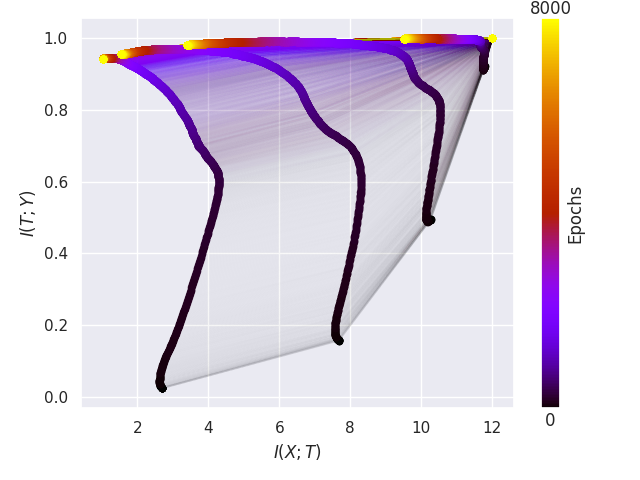

# ibbsc
This is the repo for my BSc thesis *Information Bottleneck for Deep Learning: Theory and Experiments*. Relevant information about the code can be seen below. Briefly it allows you to train FNNs with various activation functions and estimate the mutual information between the hidden layers and the input and output using either an adaptive or uniform binning strategy. There are functions for plotting relevant quantities, such as the information plane seen below.
<p align="center">
  
</p>


## Setup
The following setup guide has been tested on **Manjaro Linux 20.0.3 Lysia**.  
I recommend installing [Miniconda3](https://docs.conda.io/en/latest/miniconda.html) on your system so you have Conda. If you have [Conda](https://docs.conda.io/en/latest/) installed on your system you can use the YAML file, `ibbsc.yml`, to setup an enviroment with the requirements by running:  

`conda env create -f ibbsc.yml`

You can activate the enviroment with:  

`conda activate ibbsc`

## Usage 
The section below assumes that `python` is linked to the correct version (it will be inside the Conda enviroment).
```  
Usage:  
    cd ibbsc
    python main.py [Parameters]
  
Parameters:  
    -h    --help                        Prints help similar to this.
    -a    --activation                  Sets the activation function for the hidden layers, but the last. Can be tanh,relu,elu or relu6. See `ibbsc/models.py` for list of supported functions as well.
    -bs   --batch_size                  Batch size for training.   
    -d    --data                        Path to the data file used for training.
    -lr   --learning_rate               Learning rate for Adam optimizer.
    -sp   --save_path                   Path to the folder for saving data.
    -e    --epochs                      Number of epochs to train on per run.  
    -num  --num_runs                    Number of times to run the network.
    -mi   --mi_methods                  List of method(s) for estimating the mutual information.
    -g    --try_gpu                     Try to train on a GPU. 
    -nb   --num_bins                    List of number of bins to use for discretization. 
    -ls   --layer_sizes                 List of the layers sizes of the network. 
    -pr   --plot_results                Generate plot of the information plane of the data just generated and save plots in --save_path .
    -sm   --save_max_vals               Save max values for each layer at each epoch.
    -ste  --save_train_error            Save training error as a function of the epochs for each run.
    -smi  --save_mutual_information     Save mutual information after each epoch.
    -sf   --start_from                  Start running experiment from a specific run number.
    -ts   --test_size                   Size of the test data.
```

For the default parameter values see `ibbsc/default_params.py`

## Examples

**Running one of these examples takes roughly 15-25 hours (dependent on the example) on a decent desktop.** 

To generate the information plane averaged over 40 runs for a network with layer sizes `[12,10,7,5,4,3,2]` (default network) the `tanh` activation function and the mutual information estimated using:  

1) The adaptive binning strategy:  
```
cd ibbsc  
python main.py -a=tanh -bs=256 -lr=0.0004 -sp="../data/saved_data" -num=40 -mi="[adaptive]" -nb="[30]" -pr=1 
```

2) The adaptive binning and the fixed binning strategy:  
```
cd ibbsc  
python main.py -a=tanh -bs=256 -lr=0.0004 -sp="../data/saved_data" -num=40 -mi="[fixed,adaptive]" -nb="[30]" -pr=1
```

3) The adaptive binning and the fixed binning strategy for multiple number of bins:  
```
cd ibbsc  
python main.py -a=tanh -bs=256 -lr=0.0004 -sp="../data/saved_data" -num=40 -mi="[fixed,adaptive]" -nb="[30,100]" -pr=1 
```
